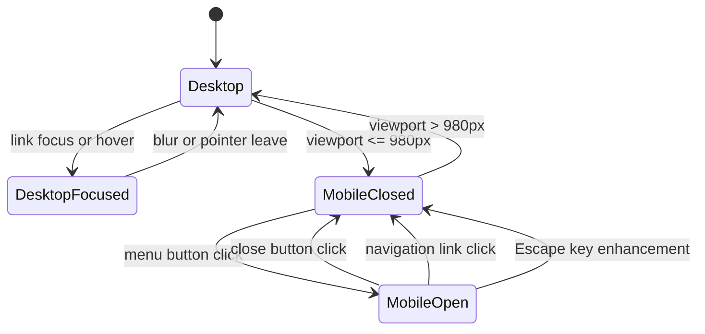
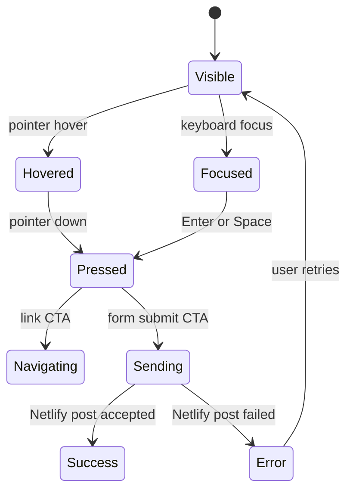
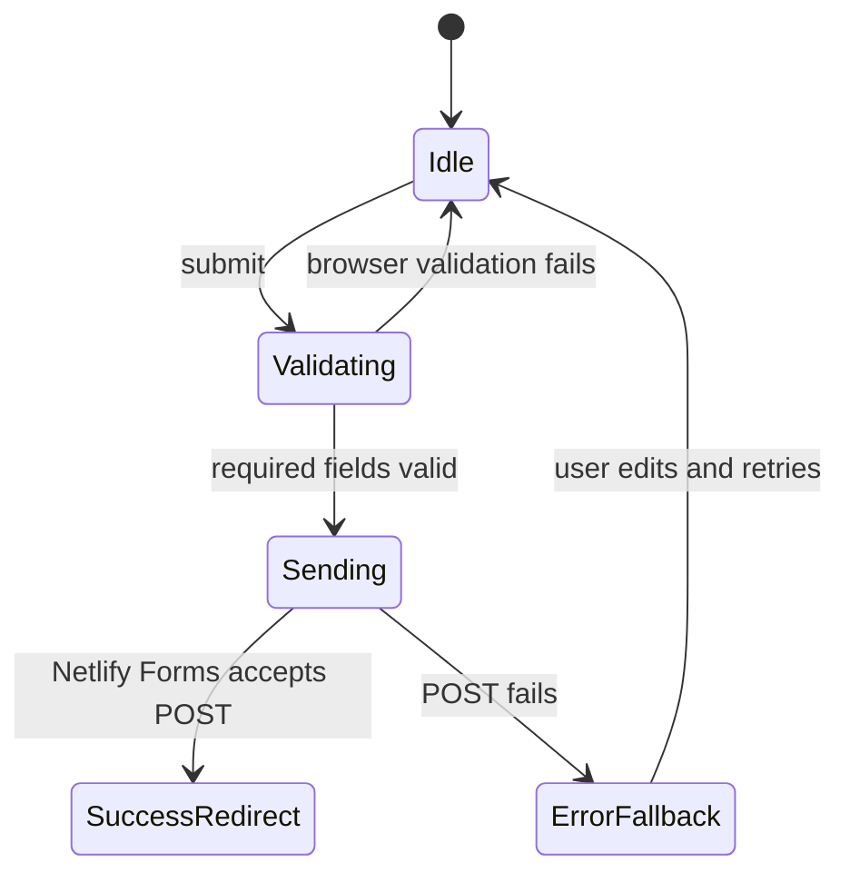
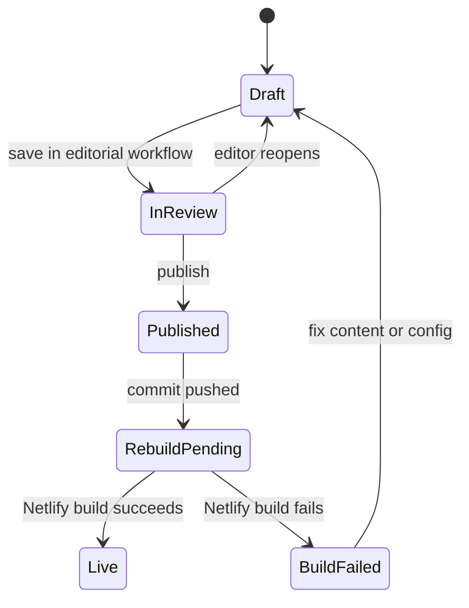

# Care Navigator State and Wiring Map

## Header State Machine



Header wiring:

- Logo links to `/`.
- Navigation links use `navItems` from `src/content/site.ts`.
- Header CTA links to `brand.bookingUrl`, currently `/contact#consultation`.
- Phone and email stay in Contact/Footer, not the top bar.

## CTA State Machine



CTA wiring:

- Service CTAs use `serviceCtaLabels`.
- Family service cards link to each service page.
- Professional CTAs link to `/contact` or `/contact#consultation`.
- Resource/newsletter CTAs link to `/news#newsletter`.

## Article CTA Block State Machine

```mermaid
stateDiagram-v2
  [*] --> NoBlocks
  NoBlocks --> DefaultNewsletterBlock: article has no ctaBlocks
  [*] --> OneBlock: article has one CMS block
  [*] --> MultipleBlocks: article has more than one CMS block
  OneBlock --> SafeLink: URL starts with /, https://, mailto:, or tel:
  MultipleBlocks --> SafeLink
  OneBlock --> FallbackLink: invalid custom URL
  MultipleBlocks --> FallbackLink: invalid custom URL
```

Article CTA block types:

- `consultation`
- `professional-referral`
- `newsletter`
- `custom-link`

Invalid custom URLs fall back to the default URL for that CTA type.

## Form State Machine



Forms:

- `consultation-enquiry`
- `professional-referral`
- `newsletter-signup`

All JavaScript-rendered form names and fields are mirrored in `public/__forms.html` for Netlify’s static form detection.

## CMS Publishing State Machine



CMS backend:

- Preferred: Netlify Identity + Git Gateway.
- Fallback: Decap GitHub backend if Git Gateway is unavailable for the new Netlify site.

## Motion And Accessibility

- Cards lift slightly on hover/focus.
- Buttons use visible hover/focus/pressed states.
- Mobile navigation slides in from the right.
- `prefers-reduced-motion` disables transitions.
- Body copy remains at accessible reading sizes: 18px desktop, 16px mobile.
